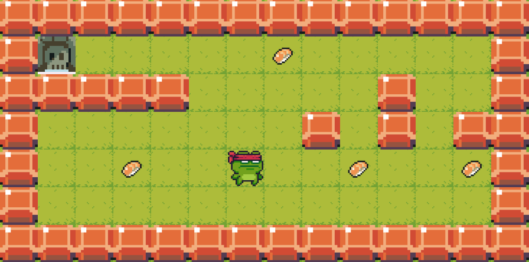

<h1 align="center">so_long</h3>

<p align="center">
    
</p>
<p align="center">This project is about writing a 2D Game in C.</p>

---
<p align="center">
    
</p>


<h3 align="center">About my Journey</h3>
This was the first project in the 42 Curriculum that made me have tons of fun with it. In terms of days, this was a short journey, but just because I was dedicating 16+ hours per day in this little project, and I just did that because I was having a lot of fun in discovering the implications and details about graphics programming. I wasn't able to do most of the features I was aiming to because I needed to keep progressing in my Common Core, but I promise that I will come back someday and make this game something really playable and fun, at least for me! If you are a 42 Cadet, treat this project with love, it will reward you with knowledge and fun.

---
<h3 align="center">How to play it (linux only)</h3>

1. Build game by running the following command
```bash
git clone https://github.com/PedroDrago/so_long.git && cd so_long && make setup
```

2. Start the game:
```bash
./play
```

---
<h3 align="center">Leaktester</h3>

In 42 projects it is not acceptable to have any kind of memory leak, and in this project you could have leaks and even not knowing it, due to the fact that you need to test your game in a lot of different maps to see if you are leak free. So, I made a simple script that uses valgrind to check if your so_long has any sort of leaks:
- [so_long_leaktester](https://github.com/PedroDrago/so_long_leaktester)

---
<h3 align="center">Art Sources</h3>

I'm a programmer, not an artist, so all the pixel art you see in the game was made by other people who gently provided free assets for anyone who would like to download it, here are the artists that made the arts that I used:

- frog character sprites
    - Artist: [PixelFrogStudio](https://twitter.com/PixelFrogStudio)
    - [Sprites Pack](https://pixelfrog-assets.itch.io/pixel-adventure-1)
- Sushi, Wall, Grass and Door
    - Artists: [Pixel Boy](https://twitter.com/2Pblog1) and [AAA](https://www.instagram.com/challenger.aaa/?hl=fr)
    - [Patreon](https://www.patreon.com/pixelarchipel)
    - [Sprites Pack](https://pixel-boy.itch.io/ninja-adventure-asset-pack)
